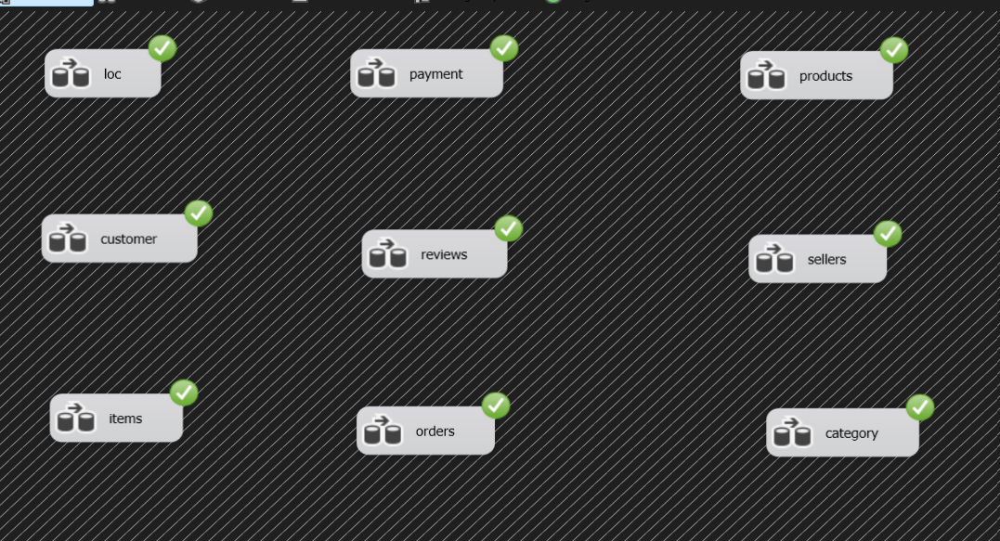
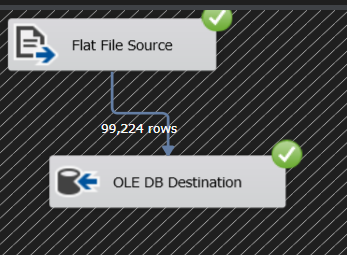
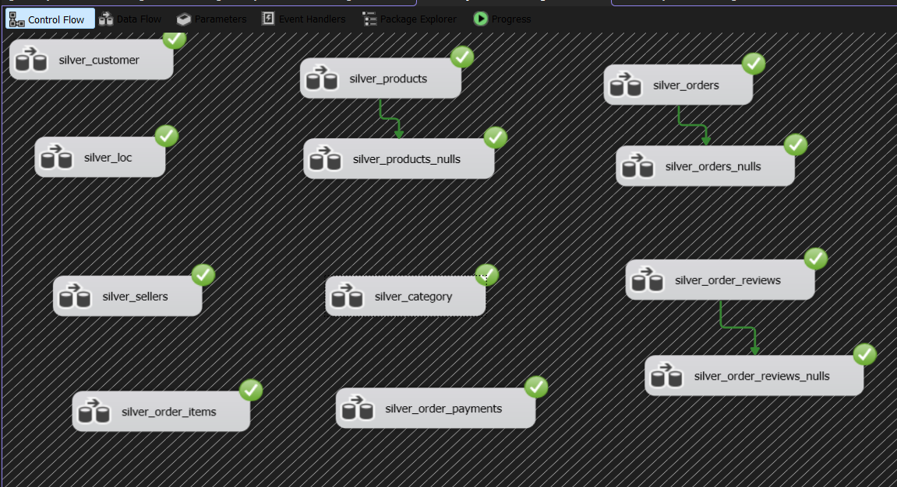
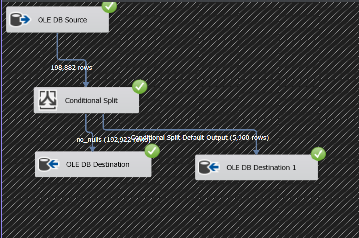
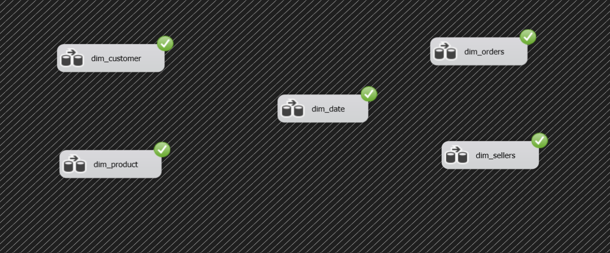
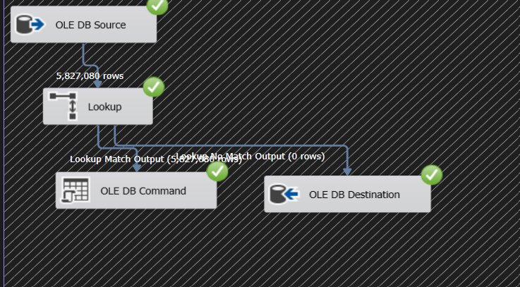

# 🛒 Olist E-Commerce Data Warehouse

A complete Data Engineering & Data Warehouse project built using the Brazilian E-Commerce Olist dataset.

The project demonstrates an end-to-end ETL pipeline that extracts raw data from CSV files, loads it into a Bronze layer, transforms and cleans it into a Silver layer, and prepares a structured Gold layer for analytics and reporting.

## 📌 Project Overview

The main goal of this project is to build a scalable and organized Data Warehouse following the Medallion Architecture:

CSV Files
   │
   ▼
┌─────────────┐
│   BRONZE    │
│ Raw Data    │
└──────┬──────┘
       │
       │ ETL / Transformations
       ▼
┌─────────────┐
│   SILVER    │
│ Clean Data  │
└──────┬──────┘
       │
       │ Dimensional Modeling
       ▼
┌─────────────┐
│    GOLD     │
│ Data Mart / │
│ Analytics   │
└─────────────┘

## 🏗️ Architecture

## 🥉 Bronze Layer

The Bronze layer stores the data extracted from the original CSV files with minimal transformations.

It contains the main Olist entities, including:

* Customers
* Sellers
* Orders
* Order Items
* Order Payments
* Order Reviews
* Products
* Geolocation
* Product Category Translation

The purpose of this layer is to preserve the source data before applying business transformations.

## 🥈 Silver Layer

The Silver layer contains cleaned and standardized data.

Transformations performed include:

* Handling NULL values
* Standardizing text values
* Removing unnecessary spaces
* Applying UPPER() where appropriate
* Standardizing city and state names
* Replacing missing categorical values with meaningful values such as UNKNOWN
* Replacing missing numeric values where required
* Handling data quality issues
* Validating duplicates and key relationships

The Silver layer is designed to provide reliable and consistent data for downstream analytical processing.

## 🥇 Gold Layer

The Gold layer is designed using Dimensional Modeling.

The data is organized into:

* Fact Tables → business events and measurable data
* Dimension Tables → descriptive information used to analyze the facts

The Gold layer is intended to support analytical queries and future BI/reporting use cases.

## 🗂️ Dataset

The project uses the Brazilian E-Commerce Public Dataset by Olist.

The dataset contains information about:

* Orders
* Customers
* Sellers
* Products
* Payments
* Reviews
* Order Items
* Geolocation
* Product Categories

## 🛠️ Technologies Used

Technology	Purpose
SQL Server	Database and Data Warehouse
SSIS	ETL and data transformations
Visual Studio	SSIS development environment
SSMS	Database management and SQL development
SQL	Data manipulation, validation and modeling
CSV	Source data

# 🔄 ETL Workflow

1. Extract

Raw Olist CSV files are used as the source.

2. Load — Bronze

The raw data is loaded into SQL Server Bronze tables using SSIS.

3. Transform — Silver

SSIS Data Flow Tasks are used to clean and standardize the data.

Examples include:

TRIM()
UPPER()
NULL handling
Data type conversion
Data standardization
Duplicate validation

4. Model — Gold

The cleaned Silver data is transformed into a dimensional model consisting of fact and dimension tables.

## 📊 Data Quality Checks

Several checks are performed throughout the pipeline, including:

* Duplicate detection
* NULL value checks
* Primary key validation
* Foreign key relationships
* Data type consistency
* Referential integrity
* Record count validation
* Transformation validation

## 🎯 Project Goals

This project was built to practice and demonstrate:

* ETL development
* SSIS package development
* Data cleaning
* Data transformation
* SQL Server
* Data Warehouse architecture
* Medallion Architecture
* Dimensional Modeling
* Fact and Dimension design
* Data quality validation
* Relational database concepts
* End-to-end Data Engineering workflows

## 🚀 Future Improvements

Possible future improvements include:

* Implementing incremental loading
* Adding Slowly Changing Dimensions (SCD)
* Improving ETL logging and error handling
* Adding audit tables
* Automating the ETL pipeline
* Connecting the Gold layer to Power BI
* Building analytical dashboards
* Adding more advanced data quality checks
* Scheduling the ETL pipeline

## 📈 Expected Outcome

The final result is an organized Data Warehouse that transforms raw Olist e-commerce data into clean, structured and analytics-ready data.

The architecture separates:

Raw Data → Clean Data → Business/Analytics Data

which makes the pipeline easier to maintain, validate and extend.

# 👩‍💻 Author

Nourine Fouda
Interested in Data Engineering, Data Science & Machine Learning
